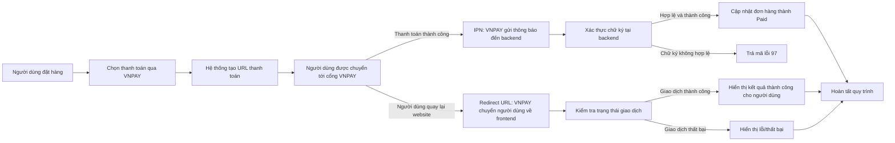

# © 2024 Phan Xuan Quang / VNPAY.NET
 


VNPAY là một dịch vụ thanh toán trực tuyến phổ biến tại Việt Nam, hỗ trợ nhiều phương thức thanh toán như thẻ tín dụng, thẻ ATM, QR Code, và ví điện tử. Việc tích hợp VNPAY vào dự án C# .NET sẽ giúp bạn cung cấp cho người dùng một phương thức thanh toán thuận tiện và bảo mật.

Mục tiêu của thư viện này là đơn giản hóa quá trình thiết lập và xử lý giao dịch cho nhà phát triển, đồng thời cải thiện hiệu suất so với code mẫu từ VNPAY.

> [!WARNING]
> - Tác giả không khuyến khích sử dụng thư viện của bên thứ ba cho tính năng thanh toán tiền **THẬT** trong dự án của bạn, ngoài phương pháp được nhà cung cấp dịch vụ thanh toán khuyến nghị.
> - Hướng dẫn tích hợp dịch vụ thanh toán của VNPAY tại [**đây**](https://sandbox.vnpayment.vn/apis/docs/thanh-toan-pay/pay.html).
> - Nhà phát triển vui lòng **đọc hết hướng dẫn của tác giả** để hạn chế lỗi không đáng có.

## :factory: Cơ chế xử lý



1. **Khởi tạo giao dịch**:
   - Người dùng tiến hành thanh toán trực tuyến và chọn phương thức thanh toán qua VNPAY.
   - Hệ thống backend tạo URL thanh toán với các tham số cần thiết.

2. **Người dùng thanh toán qua cổng VNPAY**:
   - Người dùng được chuyển hướng đến cổng thanh toán của VNPAY để thực hiện giao dịch.
   - Sau khi hoàn tất, VNPAY gọi hai nơi:
     - **IPN URL (backend)** để thông báo trạng thái giao dịch.
     - **Callback URL (frontend)** để điều hướng người dùng quay lại trang web.

3. **Xử lý trên IPN URL**:
   - Hệ thống backend nhận thông báo từ VNPAY thông qua IPN URL.
   - Nếu giao dịch hợp lệ và thành công (`vnp_ResponseCode = 00`), trạng thái đơn hàng được cập nhật thành **Paid**.

4. **Xử lý trên Callback URL**:
   - Khi người dùng quay lại trang web qua Callback URL, hệ thống kiểm tra trạng thái giao dịch dựa trên thông tin VNPAY gửi kèm.
   - Hiển thị kết quả giao dịch (thành công/thất bại/lỗi) cho người dùng.

## :electric_plug: Cài đặt thư viện `VNPAY.NET`
> [!NOTE]
> - Phiên bản dành cho .NET 8 có phiên bản dạng `8.x.x`, và phiên bản dành cho .NET 6 có phiên bản dạng `6.x.x`.
> - Từ phiên bản 6.5.0 trở lên, thư viện đã hỗ trợ Dependency Injection (DI) để cấu hình dễ dàng hơn.

- Cách 1: Tìm và cài đặt thông qua **NuGet Package Manager** nếu bạn sử dụng Visual Studio.


- Cách 2: Cài đặt thông qua môi trường dòng lệnh. Chi tiết tại [**ĐÂY**](https://www.nuget.org/packages/VNPAY.NET).

## :black_nib: Đăng ký tài khoản và lấy thông tin từ VNPAY
> [!NOTE]
> Đăng ký để lấy thông tin tích hợp tại [**ĐÂY**](https://sandbox.vnpayment.vn/devreg/). Hệ thống sẽ gửi thông tin kết nối về email được đăng ký (có thể chậm vài giờ hoặc vài ngày).

| Thông tin    | Mô tả                                                                                                                                                                           |
|--------------|--------------------------------------------------------------------------------------------------------------------------------------------------------------------------------|
| `TmnCode`      | Mã định danh kết nối được khai báo tại hệ thống của VNPAY. Mã định danh tương ứng với tên miền website, ứng dụng, dịch vụ của merchant kết nối vào VNPAY. Mỗi đơn vị có thể có một hoặc nhiều mã TmnCode kết nối. |
| `HashSecret`   | Chuỗi bí mật sử dụng để kiểm tra toàn vẹn dữ liệu khi hai hệ thống trao đổi thông tin (checksum).                                                                               |
| `BaseUrl`      | URL thanh toán. Đối với môi trường Sandbox (thử nghiệm), URL là `https://sandbox.vnpayment.vn/paymentv2/vpcpay.html`.                                                                      |
| `CallbackUrl`  | URL truy vấn kết quả giao dịch. URL này được tự động chuyển đến sau khi giao dịch được thực hiện.                                                                              |
| `Version`      | Phiên bản API VNPAY (mặc định: "2.1.0").                                                                                                                                        |
| `OrderType`    | Loại đơn hàng (mặc định: "other").                                                                                                                                              |

## :dart: Hướng dẫn sử dụng

### 1. Thêm thông tin cấu hình VNPAY vào dự án
> [!WARNING]
> Cần đảm bảo thông tin `vnp_TmnCode` và `vnp_HashSecret` bảo mật tuyệt đối.

Thêm những thông tin cấu hình lấy từ VNPAY vào `appsettings.json` như ví dụ sau:
```json
{
  "Vnpay": {
    "TmnCode": "A1B2C3D4", // Ví dụ
    "HashSecret": "A4D3C4C6D1Đ3D1D4QCS16PAFHI2GJ42D", // Ví dụ
    "BaseUrl": "https://sandbox.vnpayment.vn/paymentv2/vpcpay.html", // Ví dụ URL của môi trường Sandbox
    "CallbackUrl": "https://localhost:1234/api/Vnpay/Callback", // Ví dụ
    "Version": "2.1.0", // Tùy chọn, mặc định là 2.1.0
    "OrderType": "other" // Tùy chọn, mặc định là other
  }
}
```

### 2. Cấu hình Dependency Injection

Trong file `Program.cs`, thêm cấu hình VNPAY vào container:

```csharp
using VNPAY.NET.Extensions;

var builder = WebApplication.CreateBuilder(args);

// Thêm VNPAY service vào container
builder.Services.AddVnpay(builder.Configuration);

// Hoặc cấu hình thủ công:
// builder.Services.AddVnpay(options =>
// {
//     options.TmnCode = "YOUR_TMN_CODE";
//     options.HashSecret = "YOUR_HASH_SECRET";
//     options.BaseUrl = "https://sandbox.vnpayment.vn/paymentv2/vpcpay.html";
//     options.CallbackUrl = "https://localhost:1234/api/Vnpay/Callback";
//     options.Version = "2.1.0";
//     options.OrderType = "other";
// });

builder.Services.AddControllers();

var app = builder.Build();

app.MapControllers();
app.Run();
```

### 3. Sử dụng trong Controller

Trong Controller, inject `IVnpay` thông qua constructor:

```csharp
using VNPAY.NET;

[ApiController]
[Route("api/[controller]")]
public class VnpayController : ControllerBase
{
    private readonly IVnpay _vnpay;

    public VnpayController(IVnpay vnpay)
    {
        _vnpay = vnpay;
    }
    
    // Các phương thức xử lý thanh toán...
}
```
## ⚙️ Xây dựng các Controller xử lý thanh toán

### 1. Tạo URL thanh toán
```csharp
[HttpGet("CreatePaymentUrl")]
public ActionResult<string> CreatePaymentUrl(double moneyToPay, string description)
{
    try
    {
        var ipAddress = NetworkHelper.GetIpAddress(HttpContext); // Lấy địa chỉ IP của thiết bị thực hiện giao dịch

        var request = new PaymentRequest
        {
            PaymentId = DateTime.Now.Ticks,
            Money = moneyToPay,
            Description = description,
            IpAddress = ipAddress,
            BankCode = BankCode.ANY, // Tùy chọn. Mặc định là tất cả phương thức giao dịch
            CreatedDate = DateTime.Now, // Tùy chọn. Mặc định là thời điểm hiện tại
            Currency = Currency.VND, // Tùy chọn. Mặc định là VND (Việt Nam đồng)
            Language = DisplayLanguage.Vietnamese // Tùy chọn. Mặc định là tiếng Việt
        };

        var paymentUrl = _vnpay.GetPaymentUrl(request);

        return Created(paymentUrl, paymentUrl);
    }
    catch (Exception ex)
    {
        return BadRequest(ex.Message);
    }
}
```

- Trong đó:

| **Thuộc tính**    | **Mô tả**                                                                                                                                                                    |
|----------------------|---------------------------------------------------------------------------------------------------------------------------------------------------------|
| **PaymentId**        | Mã tham chiếu giao dịch (Transaction Reference). Đây là mã số duy nhất dùng để xác định giao dịch. Bắt buộc và không được trùng lặp giữa các giao dịch. |
| **Description**      | Thông tin mô tả nội dung thanh toán, không dấu và không chứa ký tự đặc biệt.                                                                            |
| **Money**            | Số tiền thanh toán. Không chứa ký tự phân cách thập phân, phần nghìn, hoặc ký hiệu tiền tệ.                                                            |
| **BankCode**         | Mã phương thức thanh toán, ngân hàng hoặc ví điện tử. Nếu giá trị là `BankCode.ANY`, người dùng sẽ chọn phương thức thanh toán trên giao diện VNPAY.    |
| **IpAddress**        | Địa chỉ IP của người thực hiện giao dịch.                                                                                    |
| **CreatedDate**      | Thời điểm khởi tạo giao dịch. Mặc định là ngày giờ hiện tại tại thời điểm tạo yêu cầu.                                                                  |
| **Currency**         | Đơn vị tiền tệ sử dụng thanh toán. Hiện tại chỉ hỗ trợ loại tiền tệ là `VND`.                                                                           |
| **Language**         | Ngôn ngữ hiển thị trên giao diện thanh toán của VNPAY. Mặc định là `Vietnamese`.                                                                       |

### 2. Xử lý sau thanh toán

Sử dụng IPN (Instant Payment Notification) URL cho phép hệ thống backend tự động nhận thông báo từ VNPAY khi trạng thái thanh toán thay đổi để từ đó xử lý tiếp mà không cần người dùng phải quay lại trang web. 

> [!WARNING]
> - Khi đăng ký tích hợp VNPAY, bạn cần cung cấp IPN URL (Ví dụ: `https://localhost:1234/api/Vnpay/IpnAction`) để VNPAY gọi khi có giao dịch.
> - Đường dẫn IPN phải sử dụng giao thức `HTTPS` để đảm bảo an toàn.
> - Lưu ý chi tiết đọc tại [**ĐÂY**](https://sandbox.vnpayment.vn/apis/docs/thanh-toan-pay/pay.html#l%C6%B0u-%C3%BD-1).

```csharp
[HttpGet("IpnAction")]
public IActionResult IpnAction()
{
    if (Request.QueryString.HasValue)
    {
        try
        {
            var paymentResult = _vnpay.GetPaymentResult(Request.Query);
            if (paymentResult.IsSuccess)
            {
                // Thực hiện hành động nếu thanh toán thành công tại đây. Ví dụ: Cập nhật trạng thái đơn hàng trong cơ sở dữ liệu.
                return Ok();
            }

            // Thực hiện hành động nếu thanh toán thất bại tại đây. Ví dụ: Hủy đơn hàng.
            return BadRequest("Thanh toán thất bại");
        }
        catch (Exception ex)
        {
            return BadRequest(ex.Message);
        }
    }

    return NotFound("Không tìm thấy thông tin thanh toán.");
}
```

### 3. Trả kết quả thanh toán cho người dùng
> [!NOTE]
> Đây chính là URL được tự động chuyển hướng đến sau khi kết thúc thanh toán. Ví dụ: `https://localhost:1234/api/Vnpay/Callback`.
> Phía frontend sẽ bắt kết quả phản hồi để xử lý tiếp.

> [!WARNING]
> - URL này chỉ kiểm tra kết quả thanh toán và trả về cho người dùng.
> - Không nên được sử dụng để xử lý tiếp đơn hàng.

```csharp
[HttpGet("Callback")]
public ActionResult<string> Callback()
{
    if (Request.QueryString.HasValue)
    {
        try
        {
            var paymentResult = _vnpay.GetPaymentResult(Request.Query);
            var resultDescription = $"{paymentResult.PaymentResponse.Description}. {paymentResult.TransactionStatus.Description}.";

            if (paymentResult.IsSuccess)
            {
                return Ok(resultDescription);
            }

            return BadRequest(resultDescription);
        }
        catch (Exception ex)
        {
            return BadRequest(ex.Message);
        }
    }

    return NotFound("Không tìm thấy thông tin thanh toán.");
}
```

Kết quả trả về có dạng như sau:
```json
{
    "paymentId": 638697289176052600,
    "isSuccess": true,
    "description": "1",
    "timestamp": "2024-12-13T23:21:59",
    "vnpayTransactionId": 14742893,
    "paymentMethod": "ATM",
    "paymentResponse": {
        "code": 0,
        "description": "Giao dịch thành công"
    },
    "transactionStatus": {
        "code": 0,
        "description": "Giao dịch thành công"
    },
    "bankingInfor": {
        "bankCode": "NCB",
        "bankTransactionId": "VNP14742893"
    }
}
```
- Trong đó:

| Thuộc tính               | Kiểu dữ liệu | Mô tả                                                  |
|--------------------------|--------------|--------------------------------------------------------|
| `PaymentId`              | long         | Mã thanh toán duy nhất cho giao dịch.                  |
| `IsSuccess`              | bool         | Trạng thái giao dịch thành công. Giá trị là `true` nếu chữ ký chính xác, *PaymentResponse.ResponseCode* và *TransactionStatus.Code* đều bằng 0. |
| `Description`            | string       | Mô tả về giao dịch.                        |
| `Timestamp`              | DateTime     | Thời gian giao dịch được thực hiện.                   |
| `VnpayTransactionId`     | long         | Mã giao dịch của hệ thống VNPAY.                       |
| `PaymentMethod`          | string       | Phương thức thanh toán (ví dụ: ATM, thẻ tín dụng).    |
| `PaymentResponse.Code`   | int          | Mã phản hồi từ hệ thống VNPAY (0 là thành công).       |
| `PaymentResponse.Description` | string   | Mô tả chi tiết mã phản hồi từ VNPAY.                   |
| `TransactionStatus.Code` | int          | Mã trạng thái giao dịch (0 là thành công).             |
| `TransactionStatus.Description` | string | Mô tả chi tiết về trạng thái giao dịch.                |
| `BankingInfor.BankCode`  | string       | Mã ngân hàng (ví dụ: NCB, Vietcombank).                |
| `BankingInfor.BankTransactionId` | string | Mã giao dịch của ngân hàng.                            |

## :exclamation: Lưu ý khi triển khai
- Thay `BaseUrl` thành URL chính thức của VNPAY.
- Đảm bảo bảo mật cho `HashSecret`.
- Thông tin tài khoản để chạy thử trên môi trường Sandbox tại [**ĐÂY**](https://sandbox.vnpayment.vn/apis/vnpay-demo/#th%C3%B4ng-tin-th%E1%BA%BB-test).
   

## :gift: Ủng hộ tác giả

**VNPAY.NET** là thư viện mã nguồn mở và hoàn toàn miễn phí cho `.NET`. Mọi người có thể ủng hộ tác giả và dự án này bằng cách để lại một :star: cho dự án, và đừng quên tặng tác giả cốc cà phê để tiếp thêm nhiều động lực.

<a href="https://i.imgur.com/9YpRPQs.jpeg" target="_blank">
  
</a>
<a href="https://me.momo.vn/phanxuanquang" target="_blank">
  
</a>
<a href="https://i.imgur.com/00NqiL8.jpeg" target="_blank">
  
</a>
