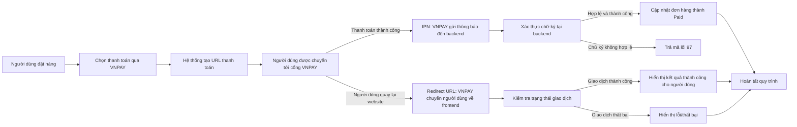

# © 2024 Phan Xuan Quang / VNPAY.NET
 


VNPAY là một dịch vụ thanh toán trực tuyến phổ biến tại Việt Nam, hỗ trợ nhiều phương thức thanh toán như thẻ tín dụng, thẻ ATM, QR Code, và ví điện tử. Việc tích hợp VNPAY vào dự án C# .NET sẽ giúp bạn cung cấp cho người dùng một phương thức thanh toán thuận tiện và bảo mật.

Mục tiêu của thư viện này là đơn giản hóa quá trình thiết lập và xử lý giao dịch cho nhà phát triển, đồng thời cải thiện hiệu suất so với code mẫu từ VNPAY.

> [!WARNING]
> - Tác giả không khuyến khích sử dụng thư viện của bên thứ ba cho tính năng thanh toán tiền **THẬT** trong dự án của bạn, ngoài phương pháp được nhà cung cấp dịch vụ thanh toán khuyến nghị.
> - Hướng dẫn tích hợp dịch vụ thanh toán của VNPAY tại [**đây**](https://sandbox.vnpayment.vn/apis/docs/thanh-toan-pay/pay.html).
> - Nhà phát triển vui lòng **đọc hết hướng dẫn của tác giả** để hạn chế lỗi không đáng có.

## :factory: Cơ chế xử lý


```mermaid
flowchart LR
    A[Người dùng đặt hàng] --> B[Chọn thanh toán qua VNPAY]
    B --> C[Hệ thống tạo URL thanh toán]
    C --> D[Người dùng được chuyển tới cổng VNPAY]
    D -->|Thanh toán thành công| E[IPN: VNPAY gửi thông báo đến backend]
    D -->|Người dùng quay lại website| F[Redirect URL: VNPAY chuyển người dùng về frontend]
    
    E --> G[Xác thực chữ ký tại backend]
    G -->|Hợp lệ và thành công| H[Cập nhật đơn hàng thành Paid]
    G -->|Chữ ký không hợp lệ| I[Trả mã lỗi 97]
    
    F --> J[Kiểm tra trạng thái giao dịch]
    J -->|Giao dịch thành công| K[Hiển thị kết quả thành công cho người dùng]
    J -->|Giao dịch thất bại| L[Hiển thị lỗi/thất bại]
    
    H --> M[Hoàn tất quy trình]
    K --> M
    L --> M
```

1. **Khởi tạo giao dịch**:
   - Người dùng tiến hành thanh toán trực tuyến và chọn phương thức thanh toán qua VNPAY.
   - Hệ thống backend tạo URL thanh toán với các tham số cần thiết.

2. **Người dùng thanh toán qua cổng VNPAY**:
   - Người dùng được chuyển hướng đến cổng thanh toán của VNPAY để thực hiện giao dịch.
   - Sau khi hoàn tất, VNPAY gọi hai nơi:
     - **IPN URL (backend)** để thông báo trạng thái giao dịch.
     - **Callback URL (frontend)** để điều hướng người dùng quay lại trang web.

3. **Xử lý trên IPN URL**:
   - Hệ thống backend nhận thông báo từ VNPAY thông qua IPN URL.
   - Nếu giao dịch hợp lệ và thành công (`vnp_ResponseCode = 00`), trạng thái đơn hàng được cập nhật thành **Paid**.

4. **Xử lý trên Callback URL**:
   - Khi người dùng quay lại trang web qua Callback URL, hệ thống kiểm tra trạng thái giao dịch dựa trên thông tin VNPAY gửi kèm.
   - Hiển thị kết quả giao dịch (thành công/thất bại/lỗi) cho người dùng.

## :electric_plug: Cài đặt thư viện `VNPAY.NET`
- Cách 1: Tìm và cài đặt thông qua **NuGet Package Manager** nếu bạn sử dụng Visual Studio.


- Cách 2: Cài đặt thông qua môi trường dòng lệnh. Chi tiết tại [**ĐÂY**](https://www.nuget.org/packages/VNPAY.NET).

## :black_nib: Đăng ký tài khoản và lấy thông tin từ VNPAY
> [!NOTE]
> Đăng ký để lấy thông tin tích hợp tại [**ĐÂY**](https://sandbox.vnpayment.vn/devreg/). Hệ thống sẽ gửi thông tin kết nối về email được đăng ký (có thể chậm vài giờ hoặc vài ngày).

| Thông tin    | Mô tả                                                                                                                                                                           |
|--------------|--------------------------------------------------------------------------------------------------------------------------------------------------------------------------------|
| `TmnCode`      | Mã định danh kết nối được khai báo tại hệ thống của VNPAY. Mã định danh tương ứng với tên miền website, ứng dụng, dịch vụ của merchant kết nối vào VNPAY. Mỗi đơn vị có thể có một hoặc nhiều mã TmnCode kết nối. |
| `HashSecret`   | Chuỗi bí mật sử dụng để kiểm tra toàn vẹn dữ liệu khi hai hệ thống trao đổi thông tin (checksum).                                                                               |
| `BaseUrl`      | URL thanh toán. Đối với môi trường Sandbox (thử nghiệm), URL là `https://sandbox.vnpayment.vn/paymentv2/vpcpay.html`.                                                                      |
| `CallbackUrl`  | URL truy vấn kết quả giao dịch. URL này được tự động chuyển đến sau khi giao dịch được thực hiện.                                                                              |
| `Version`      | Phiên bản API VNPAY (mặc định: "2.1.0").                                                                                                                                        |
| `OrderType`    | Loại đơn hàng (mặc định: "other").                                                                                                                                              |

## :dart: Hướng dẫn sử dụng

### 1. Thêm thông tin cấu hình VNPAY vào dự án
> [!WARNING]
> Cần đảm bảo thông tin `vnp_TmnCode` và `vnp_HashSecret` bảo mật tuyệt đối.

Thêm những thông tin cấu hình lấy từ VNPAY vào `appsettings.json` như ví dụ sau:
```json
{
  "VNPAY": {
    "TmnCode": "A1B2C3D4", // Ví dụ
    "HashSecret": "A4D3C4C6D1Đ3D1D4QCS16PAFHI2GJ42D", // Ví dụ
    "BaseUrl": "https://sandbox.vnpayment.vn/paymentv2/vpcpay.html", // Tùy chọn, mặc định là URL thanh toán môi trường TEST
    "CallbackUrl": "https://localhost:1234/api/Vnpay/Callback", // Ví dụ
    "Version": "2.1.0", // Tùy chọn, mặc định là 2.1.0
    "OrderType": "other" // Tùy chọn, mặc định là other
  }
}
```

### 2. Cấu hình Dependency Injection

Trong file `Program.cs`, thêm cấu hình VNPAY vào container:

```csharp
using VNPAY.Extensions;

var vnpayConfig = builder.Configuration.GetSection("VNPAY");

builder.Services.AddVnpayClient(config =>
{
    config.TmnCode = vnpayConfig["TmnCode"]!;
    config.HashSecret = vnpayConfig["HashSecret"]!;
    config.CallbackUrl = vnpayConfig["CallbackUrl"]!;
    // config.BaseUrl = vnpayConfig["BaseUrl"]!; // Tùy chọn. Nếu không thiết lập, giá trị mặc định là URL thanh toán môi trường TEST
    // config.Version = vnpayConfig["Version"]!; // Tùy chọn. Nếu không thiết lập, giá trị mặc định là "2.1.0"
    // config.OrderType = vnpayConfig["OrderType"]!; // Tùy chọn. Nếu không thiết lập, giá trị mặc định là "other"
});
```

### 3. Sử dụng trong Controller

Trong Controller, inject `IVnpay` thông qua constructor:

```csharp
using VNPAY.NET;

[ApiController]
[Route("api/[controller]")]
public class VnpayController : ControllerBase
{
    private readonly IVnpayClient _vnpayClient;

    public VnpayController(IVnpayClient vnpayClient)
    {
         _vnpayClient = vnpayClient;
    }
    
    // Các phương thức xử lý thanh toán...
}
```
## ⚙️ Xây dựng các Controller xử lý thanh toán

### 1. Tạo URL thanh toán

- Cách 1 - Tạo nhanh:

```csharp
var moneyToPay = 10000; // Số tiền phải thanh toán (ví dụ: 10.000 VND)
var description = "Thanh toan don hang ABC"; // Mô tả giao dịch
var bankCode = BankCode.ANY; // Mã phương thức thanh toán

var paymentUrlInfo = _vnpayClient.CreatePaymentUrl(money, description, bankCode);
var paymentUrl = paymentUrlInfo.Url;
```

- Cách 2 - Tạo yêu cầu thanh toán chi tiết:

```csharp
var request = new VnpayPaymentRequest
{
    Money = 10000, // Số tiền thanh toán (ví dụ: 10.000 VND)
    Description = "Thanh toan don hang ABC", // Mô tả giao dịch
    BankCode = BankCode.ANY, // Tùy chọn. Mã phương thức thanh toán. Mặc định là tất cả phương thức giao dịch
    Language = DisplayLanguage.Vietnamese // Tùy chọn. Mặc định là tiếng Việt
};

var paymentUrlInfor = _vnpayClient.CreatePaymentUrl(request);
var paymentUrl = paymentUrlInfo.Url;
```

### 2. Xử lý sau thanh toán

Sử dụng IPN (Instant Payment Notification) URL cho phép hệ thống backend tự động nhận thông báo từ VNPAY khi trạng thái thanh toán thay đổi để từ đó xử lý tiếp mà không cần người dùng phải quay lại trang web. 

> [!WARNING]
> - Khi đăng ký tích hợp VNPAY, bạn cần cung cấp IPN URL (Ví dụ: `https://localhost:1234/api/Vnpay/ProceedAfterPayment`) để VNPAY gọi khi có giao dịch được thực hiện hoàn tất.
> - Đường dẫn IPN phải sử dụng giao thức `HTTPS` để đảm bảo an toàn.
> - Lưu ý chi tiết đọc tại [**ĐÂY**](https://sandbox.vnpayment.vn/apis/docs/thanh-toan-pay/pay.html#l%C6%B0u-%C3%BD-1).

```csharp
[HttpGet("ProceedAfterPayment")]
public IActionResult ProceedAfterPayment()
{
    try
    {
        var paymentResult = _vnpayClient.GetPaymentResult(this.Request);

        // Thực hiện hành động nếu thanh toán thành công tại đây. Ví dụ: Cập nhật trạng thái đơn hàng trong cơ sở dữ liệu.
        return Ok();
    }
    catch (VnpayException ex)  // Bắt lỗi liên quan đến VNPAY
    {
        return BadRequest(ex.Message);
    }
    catch (Exception ex)
    {
        return BadRequest(ex.Message);
    }
}
```

### 3. Trả kết quả thanh toán cho người dùng
> [!NOTE]
> Đây chính là URL được tự động chuyển hướng đến sau khi kết thúc thanh toán. Ví dụ: `https://localhost:1234/api/Vnpay/Callback`.
> Phía frontend sẽ bắt kết quả phản hồi để xử lý tiếp.

> [!WARNING]
> - URL này chỉ kiểm tra kết quả thanh toán và trả về cho người dùng.
> - Không nên được sử dụng để xử lý tiếp đơn hàng.

## :exclamation: Lưu ý khi triển khai
- Thay `BaseUrl` thành URL chính thức của VNPAY.
- Đảm bảo bảo mật cho `HashSecret`.
- Thông tin tài khoản để chạy thử trên môi trường Sandbox tại [**ĐÂY**](https://sandbox.vnpayment.vn/apis/vnpay-demo/#th%C3%B4ng-tin-th%E1%BA%BB-test).
   

## :gift: Ủng hộ tác giả

**VNPAY.NET** là thư viện mã nguồn mở và hoàn toàn miễn phí cho `.NET`. Mọi người có thể ủng hộ tác giả và dự án này bằng cách để lại một :star: cho dự án, và đừng quên tặng tác giả cốc cà phê để tiếp thêm nhiều động lực.

<a href="https://i.imgur.com/9YpRPQs.jpeg" target="_blank">
  
</a>
<a href="https://me.momo.vn/phanxuanquang" target="_blank">
  
</a>
<a href="https://i.imgur.com/00NqiL8.jpeg" target="_blank">
  
</a>
